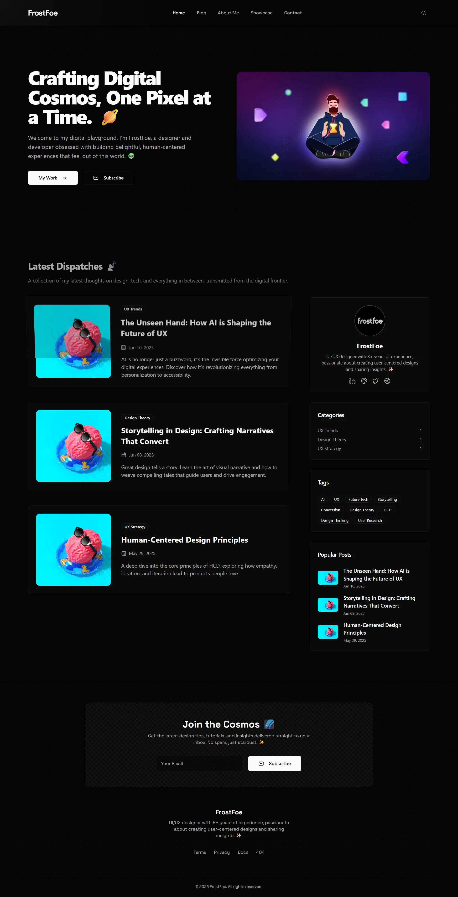
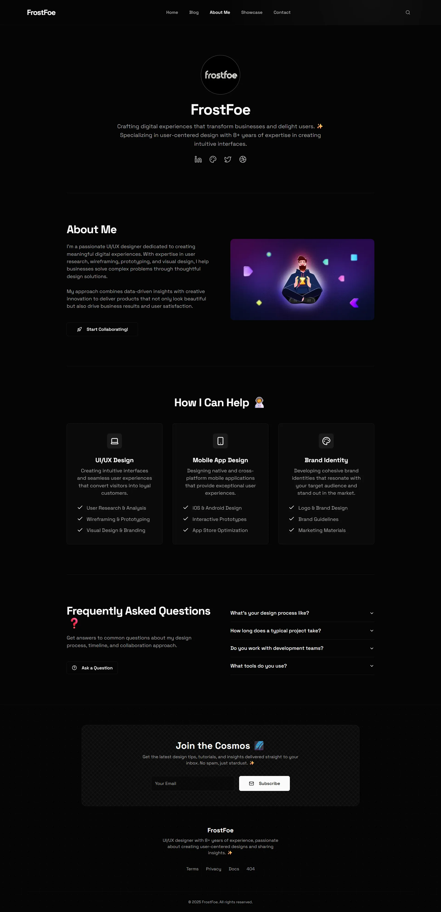
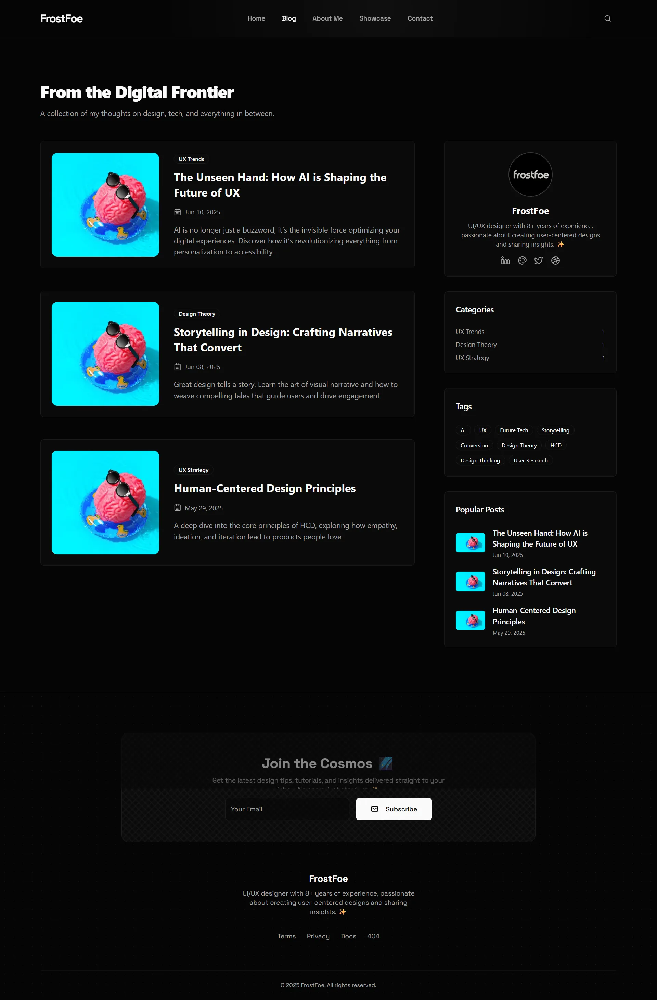

  

  🔗 <strong>Live Preview:</strong> <a href="https://ff-nextjs-portfolio-01.netlify.app/" target="_blank">ff-nextjs-portfolio-01.netlify.app</a>

---

## ✨ Main Features

- **Portfolio Showcase:** A dedicated section to showcase projects with images and descriptions.
- **MDX Blog:** A feature-rich blog with posts written in MDX, allowing for custom React components within markdown.
- **Search Functionality:** An integrated search feature for finding posts by title, description, or content.
- **Categorization and Tagging:** Blog posts are organized with categories and tags for easy navigation.
- **Fully Responsive Design:** The website is designed to provide an optimal experience on all screen sizes, from mobile to desktop.
- **Interactive & Animated UI:** Includes smooth animations and particle effects using Framer Motion and tsParticles for a dynamic user experience.
- **Comments Section:** Allows users to leave comments on blog posts.
- **Static Site Generation (SSG):** Leverages Next.js App Router and SSG for fast performance, SEO benefits, and a modern architecture.

## 🛠️ Technologies Used

- **Framework:** [Next.js](https://nextjs.org/) (App Router)
- **Language:** [TypeScript](https://www.typescriptlang.org/)
- **Styling:** [Tailwind CSS](https://tailwindcss.com/)
- **UI Components:** [ShadCN UI](https://ui.shadcn.com/), [Radix UI](https://www.radix-ui.com/)
- **Content:** [MDX](https://mdxjs.com/)
- **Animation:** [Framer Motion](https://www.framer.com/motion/), [tsParticles](https://particles.js.org/)
- **Form Handling:** [React Hook Form](https://react-hook-form.com/), [Zod](https://zod.dev/)
- **Icons:** [Lucide React](https://lucide.dev/)
- **Linting:** [ESLint](https://eslint.org/)

## 🖼️ Screenshots

### Home Page

### About Page

### Blog Page

© 2025 FrostFoe. All rights reserved.

